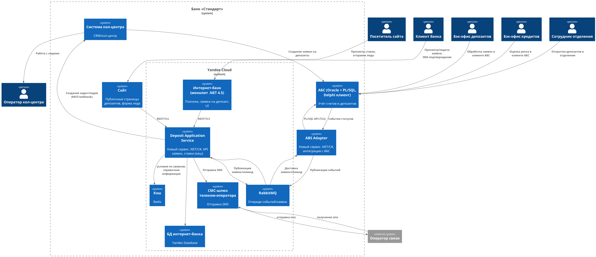

**Название задачи:** ADR-001: MVP "Открытие депозитов онлайн"   
**Автор:**  Слепцов Денис   
**Дата:** 2025-09-13   

### Функциональные требования (Use Cases)

| **№** | **Действующие лица или системы**                                                                              | **Use Case**                               | **Описание**                                                                                                                                                                                                                                                                                                                                                                                                                                                                                                                 |
|:-----:|:--------------------------------------------------------------------------------------------------------------|:-------------------------------------------|:-----------------------------------------------------------------------------------------------------------------------------------------------------------------------------------------------------------------------------------------------------------------------------------------------------------------------------------------------------------------------------------------------------------------------------------------------------------------------------------------------------------------------------|
|  UC1  | Посетитель Сайта, Сайт, Deposit Application Service (DAS), Менеджер кол-центра, Система кол-центра кол-центра | Подача лида на депозит с сайта             | 1) Посетитель открывает страницу депозитов и видит актуальные публичные ставки. 2) Заполняет ФИО и телефон и отправляет форму. 3) Сайт по TLS вызывает API DAS и создаёт заявку-лид. 4) DAS присваивает номер заявки, сохраняет и отправляет уведомление менеджеру депозитов; возвращает сайту номер заявки. 5) Пользователю отображается номер заявки и сообщение с просьбой ожидать звонка.                                                                                                                                |
|  UC2  | Клиент ИБ, Интернет-банк (IB), DAS, SMS-шлюз                                                                  | Подача заявки на депозит в ИБ              | 1) Клиент авторизован в ИБ и открывает раздел «Депозиты». 2) ИБ запрашивает из DAS список продуктов и персональные ставки. 3) Клиент выбирает счёт-источник и сумму, отправляет заявку. 4) ИБ запрашивает у DAS одноразовый код; DAS отправляет SMS через SMS-шлюз. 5) Клиент вводит SMS-код, ИБ передаёт его DAS, заявка зафиксирована. 6) DAS возвращает номер заявки и статус "На рассмотрении"                                                                                                                           |
|  UC3  | Менеджер депозитов, ABS Adapter, АБС, SMS-шлюз                                                                | Рассмотрение заявки и подтверждение ставки | 1) DAS публикует заявку в очередь, ABS Adapter получает и создаёт карточку заявки в АБС через PL/SQL API. 2) Менеджер в клиенте АБС анализирует заявку, при необходимости запрашивает у кредитного бэк-офиса данные риска (как сейчас). 3) Менеджер устанавливает ставку/условия и подтверждает. 4) АБС меняет статус заявки; ABS Adapter фиксирует событие и отправляет его в DAS (через очередь/вебхук). 5) DAS формирует текст договора; 6) DAS отправляет SMS "Депозит одобрен" с короткой ссылкой на одобренные условия |
|  UC4  | АБС, ABS Adapter, DAS, SMS-шлюз                                                                               | Открытие депозита                          | 1) После подтверждения условий менеджер создаёт депозит в АБС. 2) АБС инициирует перемещение средств со счёта клиента (если ИБ-заявка) или ожидает визит/подписание (если сайт/отделение). 3) При успешном открытии АБС публикует событие «Депозит открыт»; ABS Adapter передаёт событие в DAS. 4) DAS отправляет SMS об успешном открытии                                                                                                                                                                                   |
|  UC6  | Менеджер кол-центра, Система кол-центра, DAS                                                                  | Обработка лидов и спецусловий              | 1) Менеджер обзванивает лиды, фиксирует результат. 2) При интересе к спецусловиям менеджер создаёт пометку. 3) По интеграции DAS/кол-центр формируется задача бэк-офису (через очередь).                                                                                                                                                                                                                                                                                                                                     |
|  UC7  | Сотрудник отделения, АБС                                                                                      | Получение одобренной ставки в отделении    | 1) Клиент приходит с номером заявки (из SMS). 2) Сотрудник отделения в клиенте АБС находит заявку и видит одобренные условия. 3) Открытие депозита и загрузка подписанных документов в АБС.                                                                                                                                                                                                                                                                                                                                  |

*Примечание:* MVP не требует новых UI для бэк-офиса — используется существующий десктоп-клиент АБС. Для ИБ изменения минимальны: интеграция с DAS и экран подачи заявки.

### Нефункциональные и архитектурно значимые требования

| № | Требование |
|:-:|:-|
| NFR1 | Доступность 99,9% для сайта и интернет-банка; режим 24/7; выдерживание отказа одного ЦОД. |
| NFR2 | Быстрый отклик UI (субсекундная загрузка страниц; несколько миллисекунд на локальные операции). |
| NFR3 | Сквозное шифрование TLS между сайтом/ИБ и сервисами, а также между новыми сервисами и АБС. |
| NFR4 | Минимизация нагрузки на АБС; исключить прямые вызовы ИБ → АБС в новом процессе; асинхронные интеграции. |
| NFR5 | Горизонтальное масштабирование новых сервисов; АБС масштабируется только вертикально. |
| NFR6 | Повторное использование стека: .NET/C# для новых сервисов; |
| NFR7 | Наблюдаемость: централизованные логи (≥ 30 дней), метрики (RT, CPU, RAM), алёртинг. |
| NFR8 | Интеграционное тестирование и договорные контракты API (OpenAPI). |
| NFR9 | Возможность миграции облако ↔ on‑prem (абстракция хранения, инфраструктура‑как‑код, без привязки к специфике облака). |
### **Решение**

- Было принято решение мигрировать монолит интернет-банка и sms-шлюз в облако, потому что существующая архитектура может не выдержать нагрузку после запуска MVP. В качестве альтернатив рассматривалась также Azure.    
Плюсы Azure:
   - поскольку ИБ написан на C#, то это самое очевидное и простое в реализации решение
   - Azure Express позволяет подключить свою on-prem БД по высокоскоростному соединению и избежать миграции БД

   Минусы:
     - неясно, насколько надёжно в данный момент использование Azure из России (в т.ч. через посредников). 
     - риски несоответствия законам РФ о персональных данных.
После успешного запуска MVP можно будет оценить нагрузку и более точно определить требования к системе, после чего мигрировать назад on-prem на более подходящую архитектуру.

   **Возможные риски**: 
     - сложности в миграции БД (надо оценить в первую очередь до начала реализации). Не должно быть большой проблемой - поскольку сейчас ИБ используется мало, допустим значительный downtime во время миграции.
     - сложности в процессе обратной миграции и большая стоимость использования облака в долгосрочной перспективе
- Было принято решение добавить кэш для хранения справочной информации для ускорения работы ИБ. Кэш также может хранить документы по одобренным заявкам по депозитам, ссылки на которые будут отправляться пользователю.
- Было принято решение оставить ручную обработку заявок на этапе MVP. Возможные альтернативы: автоматизация выставления условий депозита исходя из текущей ключевой ставки и истории клиента в AБС - не реализуемо в отведённые сроки.

