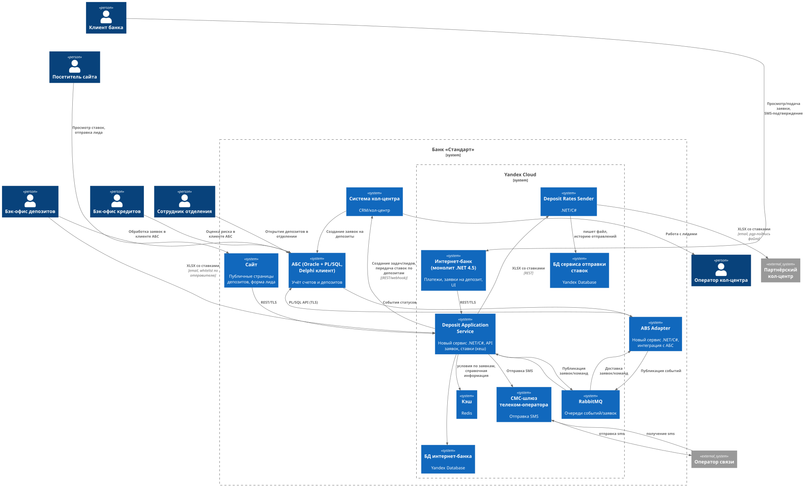

**Название задачи:** ADR-002: "Передача ставок в кол-центр (включая партнёрский кол-центр)"   
**Автор:** Слепцов Денис   
**Дата:** 2025-09-14

## Контекст и мотивация

В рамках MVP «Открытие депозитов онлайн» необходимо снизить риск перегрузки кол-центра и повысить качество консультаций для возрастной аудитории. Для этого операторы кол-центра (внутреннего и партнёрского) должны видеть актуальные депозитные ставки.  
Текущий процесс расчёта ставок ведётся в XLS-файлах бэк-офиса депозитов/кредитов. Партнёрский кол-центр — внешняя система; **API/SFTP недоступны**, но они готовы принимать файлы со ставками. Требования по безопасности остаются прежними (см. FURPS+).

### **Решение**

- Бэк-офис продолжает формировать файл с новыми значениями ставок в том же формате, в котором сейчас они рассылаются сотрудникам в отделения (описать формат в Confluence)
- Файл отправляется кем-то из авторизованных сотрудников на специальный почтовый адрес
- DAS читает и валидирует файл
- DAS передаёт XLS-файл через вебхук в систему внутреннего кол-центра, и информация об актуальных ставках становится доступна операторам
- DAS передаёт XLS-файл в новый сервис Deposit Rates Sender
- DRS обновляет актуальную версию файла в своей БД
- DRS подписывает файл электронной подписью партнёрского кол центра и отправляет им на почту
- DRS логирует факт отправки в своей БД

#### Обновлённая С4-диаграмма контейнеров

### **Альтернативы**

В качестве альтернативного решения можно было бы рассмотреть вариант, в котором мы предоставляем API для получения актуальных ставок по депозитам, но
- партнёрские кол-центры не готовы делать какие-то доработки, чтобы использовать API, они готовы только принимать файл
- если в файлы будет включена конфиденциальная информация помимо общедоступной (например, ограничения на спецпредложения, которые мы готовы сделать клиентам в зависимости от их уровня дохода), то потребуется механизм авторизации, что усложнит систему

Ещё один более простой вариант решения - не задействовать автоматизацию вовсе и обойтись хорошо описанным бизнес-процессом. Ответственный сотрудник бэк-офиса загружает файл в CRM внутреннего КЦ и отправляет на почту в партнёрский КЦ каждый раз при его обновлении.
Этот вариант сильно ухудшает информационную безопасность, т.к. 1) к CRM КЦ появляется доступ из внутренней сети бэкофиса; 2) компрометирование одного почтового ящика сотрудника бэк-офиса даёт возможность для атаки с большими репутационными последствиями (в случае, если нам придётся расторгать договоры по невалидным ставкам).
Валидация процентов на соответствие допустимому диапазону исключит такую возможность и человеческий фактор.

**Недостатки, ограничения, риски**

Неперсонализированные ставки, отображаемые на сайте, сейчас обновляются по-старому, через обновление данных в СУБД.
Из-за этого возможны расхождения, если забыть обновить их. Для этапа MVP текущего решения достаточно, но в будущем надо добавить автоматическое обновление из того же файла в письме.

## Функциональные требования (Use Cases)

|  №  | Акторы                                         | Use Case                         | Шаги (основной сценарий)                                                                                                                                                                                                                                                                                                              |
|:---:|:-----------------------------------------------|:---------------------------------|:--------------------------------------------------------------------------------------------------------------------------------------------------------------------------------------------------------------------------------------------------------------------------------------------------------------------------------------|
| UC1 | Бэк-офис депозитов, DAS                        | Публикация публичных ставок      | 1) Бэк-офис отправляет XLS ставок по почте на специальный адрес **DAS** 2) Планировщик **DAS.RatesImporter** получает новую версию XLS из письма. 3) Импорт и валидация (отправитель, схема, даты, диапазоны). 4) Сохранение версии в **DAS.RatesStore** и пометка «активная».                                                        |
| UC2 | Внутренний кол-центр, DAS                      | Доставка ставок во внутренний КЦ | 1) После активации версии **DAS.RatesPublisher** вызывает **Webhook «/rates/import»** во внутренней системе КЦ с подписанным payload. 2) КЦ обновляет справочник ставок в своей БД и подтверждает приём. 3) DAS фиксирует статус.                                                                                                     |
| UC3 | Партнёрский кол-центр, DAS, DRS, Почтовый шлюз | Доставка ставок партнёру файлом  | 1) После активации версии **DAS.RatesPublisher** отправляет XLS файл **DRS**; **DRS** шифрует **PGP** открытым ключом партнёра; подписывает. 2) Отправка по корпоративной почте на whitelist‑адреса партнёра. 3) Получение и верификация подписи на стороне партнёра (их регламент). 4) Отчёт о доставке (DSN) логируется в базе DRS. |
| UC4 | Оператор КЦ                                    | Просмотр актуальных ставок       | 1) Оператор открывает карточку подсказок в системе КЦ и видит актуальные публичные ставки (без персонализации).                                                                                                                                                                                                                       |
| UC5 | Бэк-офис депозитов, DAS                        | Отзыв/замена версии ставок       | 1) Бэк-офис помечает новую версию как активную. 2) **DAS.RatesPublisher** повторно рассылает файлы/вебхук. 3) Внутренний КЦ и партнёр получают обновление.                                                                                                                                                                            |

---

## Нефункциональные требования

- **Актуальность:** распространение новой версии ≤ 5 минут после активации.
- **Доступность:** процесс доставки ставок не должен зависеть от доступности АБС; ретраи и отложенная доставка.
- **Безопасность:** PGP‑шифрование и подпись файлов для партнёра; TLS для внутреннего вебхука; аудит каждой рассылки.
- **Трассируемость:** версионирование ставок (semver/дата‑время), хэш‑суммы файлов, журналы доставки ≥ 90 дней.
- **Форматы:** CSV (RFC 4180) и XLSX; локаль — десятичный разделитель «.»; кодировка UTF‑8.
- **Совместимость:** минимум изменений в существующей системе КЦ; отсутствие изменений в ядре ИБ.
- **Производительность:** импорт XLS ≤ 10 сек; публикация в КЦ ≤ 30 сек; формирование и отправка писем ≤ 60 сек/адрес.